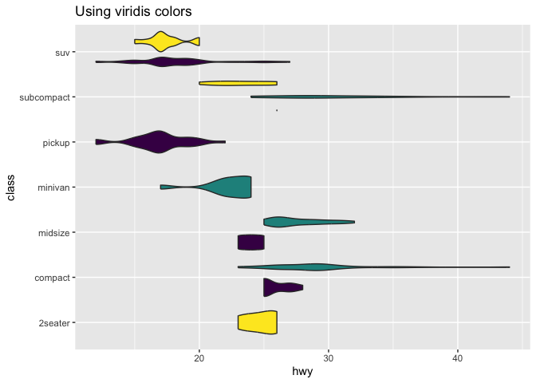
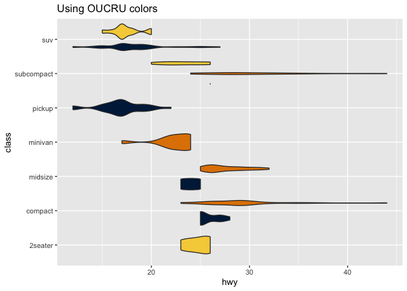

# oucru

Collection of helper and miscellaneous functions used for and by the
Oxford University Clinical Research Unit (OUCRU), Vietnam

CI/CD statuses:

- [](https://github.com/OUCRU-Modelling/oucru/actions/workflows/R-CMD-check.yaml)
- [](https://github.com/OUCRU-Modelling/oucru/actions/workflows/pkgdown.yaml)

## Installation

You can install the development version of oucru from
[GitHub](https://github.com/) with:

``` r
# install.packages("pak")
pak::pak("OUCRU-Modelling/oucru")
```

## Example

### OUCRU colors and palette

Basic example for using OUCRU color palette for `ggplot2`

``` r
library(ggplot2)
library(oucru)

p <- ggplot(mpg, aes(hwy, class, fill = drv)) +
  geom_violin(show.legend = FALSE)

# typical figure with viridis colors
p +
  scale_fill_viridis_d() +
  ggtitle("Using viridis colors")
```



``` r

# use OUCRU main color palette
p +
  scale_fill_oucru_d(palette = "main") +
  ggtitle("Using OUCRU colors")
```


